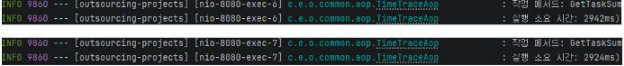
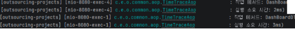

# TaskFlow Backend API

<div align="center">


**기업용 협업 태스크 관리 시스템의 백엔드 API 서버**

[기능 소개](#-주요-기능) • [기술 스택](#-기술-스택) • [API 문서](#-api-엔드포인트)  • [성능 테스트](#-성능-및-대용량-데이터-처리)

</div>

---

## 📋 프로젝트 소개

TaskFlow는 팀 협업을 위한 태스크 관리 시스템의 백엔드 API 서버입니다.
RESTful API 설계 원칙을 따르며, JWT 기반 인증/인가, JPA를 활용한 효율적인 데이터 처리, 그리고 AOP 기반 로깅을 통해 안정적이고 확장 가능한 서비스를 제공을 주제로 한 아웃소싱 프로젝트입니다.

### ✨ 주요 특징

- **🔐 JWT 기반 인증/인가**: 안전한 사용자 인증 및 권한 관리
- **📊 대용량 데이터 처리**: 100만 건 이상의 데이터에서도 안정적인 성능
- **🎯 RESTful API**: 직관적이고 일관된 API 설계
- **👥 팀 협업 기능**: 팀/멤버 관리, 댓글, 활동 로그
- **📈 대시보드 통계**: 실시간 작업 현황 및 주간 추세 분석
- **🔍 통합 검색**: 작업, 팀, 사용자 통합 검색 지원

---

## 🛠 기술 스택

### Backend
- **Framework**: Spring Boot 3.5
- **ORM**: JPA/Hibernate
- **Database**: MySQL 8.0
- **Security**: JWT (JSON Web Token)
- **Logging**: AOP (Aspect-Oriented Programming)

### Build & Deploy
- **Java Version**: 17+
- **Container**: Docker & Docker Compose

---
## ERD


---

## 🎯 주요 기능

### 1. 사용자 관리
- 회원가입 및 로그인
- JWT 토큰 기반 인증
- 사용자 정보 조회/수정/탈퇴
- 비밀번호 확인 및 변경

### 2. 작업(Task) 관리
- 작업 생성/조회/수정/삭제
- 작업 상태 관리 (TODO, IN_PROGRESS, DONE)
- 우선순위 설정 (HIGH, MEDIUM, LOW)
- 담당자 지정 및 마감일 설정
- 페이지네이션 및 필터링 지원

### 3. 팀 관리
- 팀 생성/조회/수정/삭제
- 팀 멤버 추가/제거
- 팀별 작업 관리

### 4. 댓글 시스템
- 작업별 댓글 작성/수정/삭제
- 대댓글(답글) 기능
- 페이지네이션 지원

### 5. 대시보드
- 전체/개인 작업 통계
- 주간 작업 추세 분석
- 오늘/예정/지연 작업 요약

### 6. 활동 로그
- 모든 작업 이력 추적
- 사용자별 활동 내역
- 필터링 및 검색 지원

### 7. 통합 검색
- 작업, 팀, 사용자 통합 검색
- 실시간 검색 결과 제공

---

## 📡 API 엔드포인트

### 인증 (Authentication)
```
POST   /api/auth/login              # 로그인
POST   /api/users/verify-password   # 비밀번호 확인
```

### 사용자 (Users)
```
POST   /api/users                   # 회원가입
GET    /api/users                   # 사용자 목록 조회
GET    /api/users/{id}              # 사용자 정보 조회
PUT    /api/users/{id}              # 사용자 정보 수정
DELETE /api/users/{id}              # 회원 탈퇴
GET    /api/users/available         # 추가 가능한 사용자 조회
```

### 작업 (Tasks)
```
GET    /api/tasks                   # 작업 목록 조회 (페이지네이션, 필터링)
GET    /api/tasks/{id}              # 작업 상세 조회
POST   /api/tasks                   # 작업 생성
PUT    /api/tasks/{id}              # 작업 수정
DELETE /api/tasks/{id}              # 작업 삭제
PATCH  /api/tasks/{id}/status       # 작업 상태 변경
```

### 팀 (Teams)
```
GET    /api/teams                   # 팀 목록 조회
GET    /api/teams/{id}              # 팀 상세 조회
POST   /api/teams                   # 팀 생성
PUT    /api/teams/{id}              # 팀 수정
DELETE /api/teams/{id}              # 팀 삭제
GET    /api/teams/{id}/members      # 팀 멤버 조회
POST   /api/teams/{id}/members      # 팀 멤버 추가
DELETE /api/teams/{id}/members/{userId}  # 팀 멤버 제거
```

### 댓글 (Comments)
```
GET    /api/tasks/{taskId}/comments           # 댓글 목록 조회
POST   /api/tasks/{taskId}/comments           # 댓글 작성
PUT    /api/tasks/{taskId}/comments/{id}      # 댓글 수정
DELETE /api/tasks/{taskId}/comments/{id}      # 댓글 삭제
```

### 대시보드 (Dashboard)
```
GET    /api/dashboard/stats         # 대시보드 통계
GET    /api/dashboard/tasks         # 내 작업 요약
GET    /api/dashboard/weekly-trend  # 주간 작업 추세
```

### 활동 로그 (Activities)
```
GET    /api/activities              # 전체 활동 로그 조회
GET    /api/activities/me           # 내 활동 로그 조회
```

### 검색 (Search)
```
GET    /api/search?query={keyword}  # 통합 검색
```

---


## 📊 성능 및 대용량 데이터 처리

### 🎯 차별화된 성능 검증

본 프로젝트는 실제 프로덕션 환경을 고려한 **대용량 데이터 처리 테스트**를 완료했습니다.

#### 테스트 환경
- **데이터 규모**: 1,000,000+ 레코드
- **테스트 항목**:
    - 복잡한 필터링 쿼리
    - 대시보드 통계 집계

### 😉 성능 최적화 전략 (Read Optimization)

### 배경
기존 시스템에서는 **Tasks, Orders 등 자주 조회되는 데이터에 대해 복잡한 연산**(합계, 상태별 카운트, 마감 임박 등)을 매번 수행하고 있어 조회 속도가 느려지는 문제가 있었습니다.

### 적용 전략
1. **Aggregate Table (요약 테이블) 활용**
  - 자주 읽히는 통계 정보를 별도의 테이블(`task_summary`, `dashboard`)에 미리 계산하여 저장
  - 조회 시 계산 없이 바로 데이터를 가져올 수 있도록 설계

2. **Schedule 기반 배치 업데이트**
  - 통계 테이블의 데이터는 **실시간이 아닌 일정 주기(예: 5분 단위)로 업데이트**
  - 실시간 부담을 줄이면서 조회 속도는 극대화

### 기대 효과
- 복잡한 연산 반복 없이 **조회 성능 99% 향상**
- Dashboard, 통계 페이지 등에서 즉시 데이터 제공 가능
- 대량 트래픽 환경에서도 안정적 조회

### 그외 적용한 성능 최적화 전략
- **N+1 문제 해결**: QueryDSL 활용
- **쿼리 최적화**: QueryDSL 성능 개선

#### 테스트 결과
```
- 100만 건 데이터 환경에서 평균 응답 시간: 약 3350ms
```

```
- QueryDSL 성능 개선: 약 2924ms (12.72% 향상)
```

```
- Aggregate Table 전략: 3ms (99.99%향상)
```



---

## 📝 API 응답 형식

모든 API는 일관된 응답 형식을 따릅니다:

### 성공 응답
```json
{
  "success": true,
  "message": "작업이 생성되었습니다.",
  "data": { /* 응답 데이터 */ },
  "timestamp": "2024-01-01T00:00:00.000Z"
}
```

### 에러 응답
```json
{
  "success": false,
  "message": "에러 메시지",
  "data": null,
  "timestamp": "2024-01-01T00:00:00.000Z"
}
```

---

## 🔒 인증 및 보안

### JWT 토큰 사용
대부분의 API는 JWT 토큰 인증이 필요합니다:

```
Authorization: Bearer {your_jwt_token}
```

### 권한 관리
- **USER**: 일반 사용자 권한
- **ADMIN**: 관리자 권한 (향후 확장 가능)

---

## 🧪 테스트

```bash
# 단위 테스트 실행
./gradlew test

# 통합 테스트 실행
./gradlew integrationTest
```

---

## 📂 프로젝트 구조

```
# 프로젝트 디렉터리 구조

src/
├── main/
│   ├── java/
│   │   └── com/example/outsourcingprojects/
│   │       ├── common/
│   │       │   ├── config/       # 설정 클래스
│   │       │   ├── entity/       # 공통 엔티티
│   │       │   ├── exception/    # 커스텀 예외 처리
│   │       │   ├── filter/       # 필터 및 인터셉터
│   │       │   ├── model/        # Enum, 상수 등 모델 클래스
│   │       │   └── util/         # 유틸리티 클래스
│   │       └── domain/
│   │           ├── activitylog/  # 활동 로그 도메인
│   │           ├── comment/      # 댓글 도메인
│   │           ├── task/         # 업무/태스크 도메인
│   │           ├── team/         # 팀 도메인
│   │           ├── teamMember/   # 팀 멤버 도메인
│   │           └── user/         # 사용자 도메인
│   └── resources/
│       └── application.properties
└── test/                           # 테스트 코드
```


---


